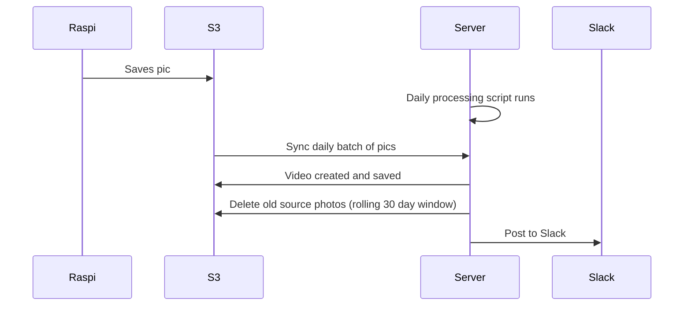
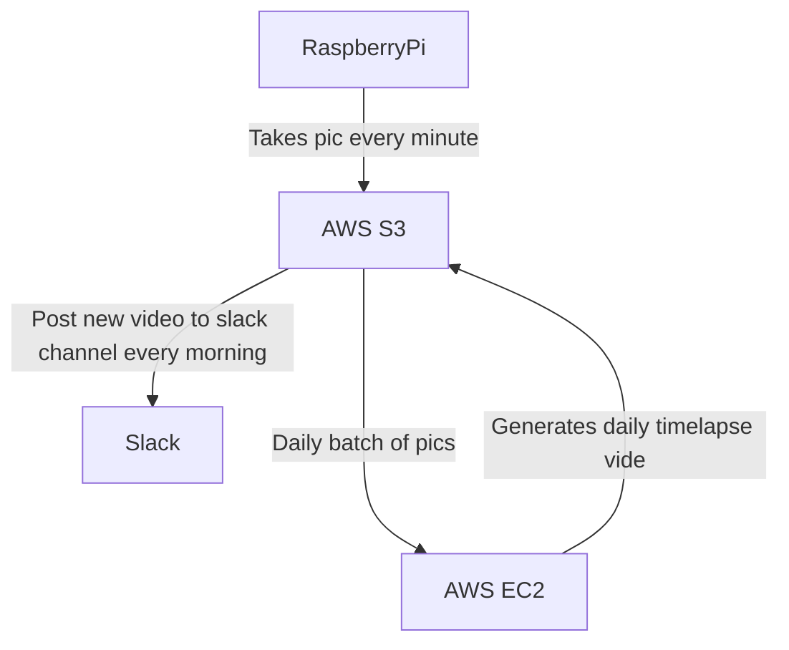

# TODO

- clear data dir at start

# Timelapse workflow

```mermaid
sequenceDiagram
    participant Raspi
    participant S3
    participant Server
    participant Slack
    Raspi->>S3: Saves pic
    Server->>Server: Daily processing script runs
    S3->>Server: Sync daily batch of pics
    Server->>S3: Video created and saved
    Server->>S3: Delete old source photos (rolling 30 day window)
    Server->>Slack: Post to Slack
```

```mermaid
    graph TD
    RaspberryPi
    S3[AWS S3]
    EC2[AWS EC2]
    Slack
    RaspberryPi--Takes pic every minute-->S3
    S3--Daily batch of pics-->EC2
    EC2--Generates daily timelapse video-->S3
    S3--Post new video to slack channel every morning-->Slack
```

# Website 

Tirelessly taking timelapses...