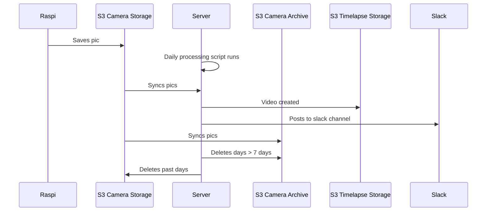

# Server

Gathers all the data from clients and generates the daily timelapses

```mermaid
sequenceDiagram
    participant Raspi
    participant S31 as S3 Camera Storage
    participant Server
    participant S32 as S3 Camera Archive
    participant S33 as S3 Timelapse Storage
    participant Slack
    Raspi->>S31: Saves pic
    Server->>Server: Daily processing script runs
    S31->>Server: Syncs pics
    Server->>S33: Video created
    Server->>Slack: Posts to slack channel
    S31->>S32: Syncs pics
    Server->>S32: Deletes days > 7 days
    Server->>S31: Deletes past days
```
