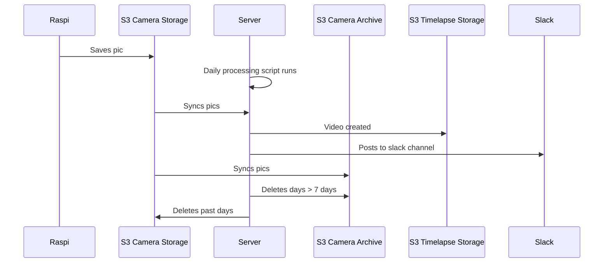

# Server

## Running daily processing manually

- sync files into s3 dir from archive like so:
  
  `aws s3 sync s3://atlascampi-archive/timelapse03/2020-05-26 ./timelapse03/2020-05-26`

- comment out `syncDay(day)` and `archive()` in `processDay()`
- call `dailyProcess.processDay("2020-05-26")`

- 

## TODO

- Generate status report of server space. You ran up your S3 bill due to buggy cleanup logic

## Setup

- system updates
  - `sudo yum update`
- set timezone
  - https://docs.aws.amazon.com/AWSEC2/latest/UserGuide/set-time.html
- git
  - `sudo yum install git -y`
  - Create SSH key
  - Add key to Github
  - `git clone git@github.com:AtlasRider/timelapse-pi.git`
- aws configure
  - `aws configure`
- python update
  - `sudo yum install python3 -y`
- script dependencies
  - `python3 -m pip install boto3 --user`
  - `python3 -m pip install console-menu --user`
  - `python3 -m pip install requests --user`
  - `python3 -m pip install pytz --user`
- install ffmpeg
  - https://forums.aws.amazon.com/thread.jspa?messageID=332091

---

mount_smbfs //admin@192.168.0.7/dev ./data

umount nas

---

